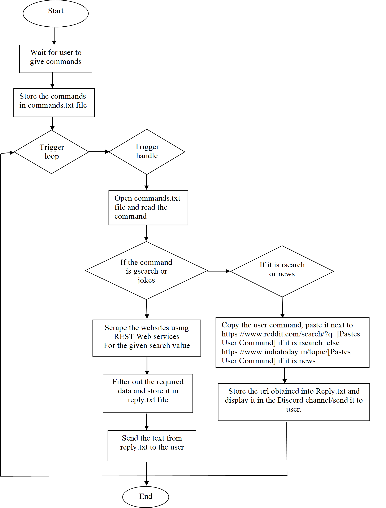

# Discord-ChatBot

## System Requirements
To install Automation Anywhere, ensure your system meets the following requirements:
- **OS:** Windows Server 2012, 2008 R2, 2003; Windows 7 or higher
- **Processor:** 3 GHz or higher
- **RAM:** 4 GB or higher
- **Storage:** 200 MB of free hard disk space
- **Browser:** IE v10 or higher, Chrome v49 or higher
- **Resolution:** 1024x768 or higher
- **Version:** Automation Anywhere A2019, Python 3 or above

## Design and Implementation

### Flow Diagram

### Implementation
Our chatbot is designed to operate on Discord, a popular chatting platform. Below are the steps to create and deploy the bot:

1. **Log in to Discord:**
   - Navigate to the [Discord website](https://discord.com/).

2. **Create an Application:**
   - Go to the application page.
   - Click the "New Application" button.
   - Name the application and click "Create".

3. **Create a Bot User:**
   - Navigate to the "Bot" tab and click "Add Bot".
   - Confirm by clicking "Yes, do it!".
   - Ensure "Public Bot" is checked to allow others to invite your bot.
   - Copy the bot token using the "Copy" button.

#### Inviting Our Bot
To add the bot to a server, follow these steps:

1. **Create an Invite URL:**
   - Log in to the Discord website and navigate to the application page.
   - Select your bot’s page and go to the "OAuth2" tab.
   - Check the "bot" checkbox under "scopes".
   - Select the necessary permissions under "Bot Permissions".
   - Copy the resulting URL, paste it into your browser, choose a server, and click "Authorize".

#### Activating the Bot
To activate the bot, we wrote a Python program using the Discord API. The bot runs on Python using the token and is synced with Automation Anywhere to function fully. Detailed synchronization steps with Automation Anywhere are covered in the next chapter.
